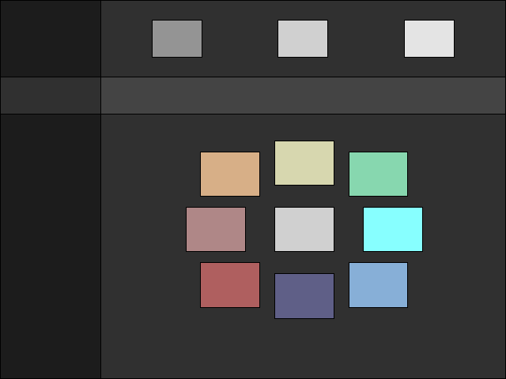
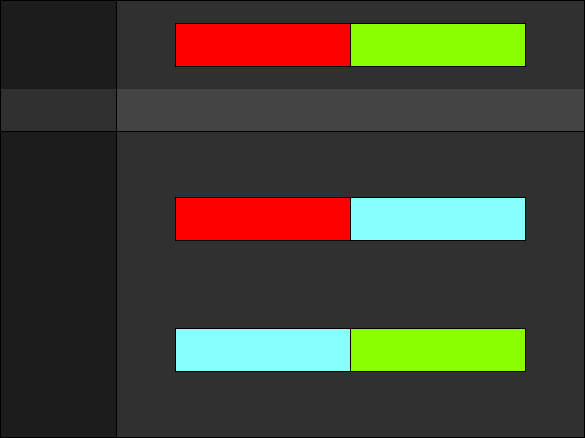

tungsten.vim, a darkish color scheme for vim

Goals:

- easy on eyes for long sessions,
- non-distracting,
- completeness of highlight groups,
- very obvious diffs,
- consistency between gui and 256 term

Colors:

Color palette:

Diff palette:

